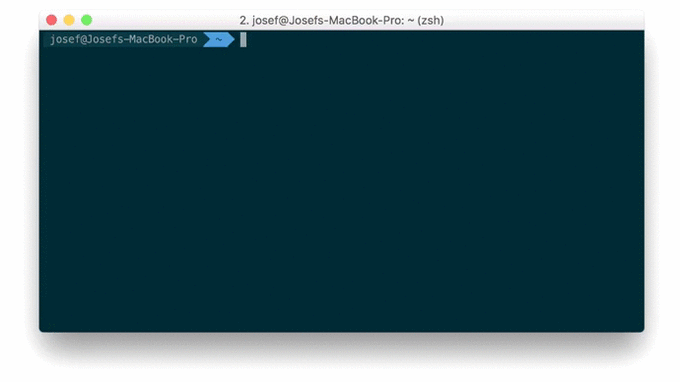

# ignorio [](https://travis-ci.com/josefdolezal/ignorio)
Ignorio is a pure Swift command line tool helping you create `.gitignore` file for your project based on templates from [gitignore.io](https://gitignore.io).

For basic usage, just run:

```bash
$ ignorio create macos xcode swift > .gitignore
```

This will fetch a `.gitignore` template for list of given types. The template will be printed to the standard output so be sure to redirect it into your `.gitignore`.

<p align="center">
    <br />
	<a href="https://github.com/josefdolezal/ignorio/"></a>
</p>

## Usage

Currently, following commands are supported by ignorio.

### Create

Fetches `.gitignore` template for given list of types. 

```bash
$ ignorio create macos xcode swift
```

### List

Prints list of types which may be used to create template.

```bash
$ ignorio list
```

### Search

Not sure if your type is supported? The list representation is not so convenient, but you can use search instead!

```bash
$ ignorio search swift
```

## Install

<details open>
<summary>From source</summary>

Ignorio requires Swift 3 and Swift Package Manager for success build.

```bash
$ make
$ ./.build/debug/ignorio
```

</details>

<details>
<summary>Brew</summary>

Not supported yet.

</details>

## Dependencies

Ignorio is build on top of following dependencies:

* [Commander](https://github.com/kylef/Commander), licensed under `BSD 3-clause`
* [Result](https://github.com/antitypical/Result), licensed under `MIT`

Big thanks to its creators and contributors! :tada:

## License

This repository is licensed under [MIT](LICENSE).
